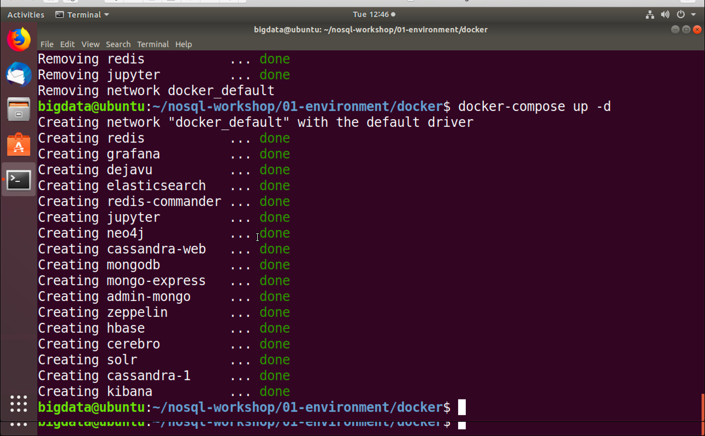

# Local Virtual Machine Environment

In this document, we will provision the platform on an Ubuntu virtual machine, which can either be run on Windows or Mac OS-X.

Open and start the Ubuntu Virtual Machine either by using **VMWare Workstation** on Windows or **VMWare Fusion** on Mac or **Virtual Box**. 

Currently the VM is configured to use 14 GB of Memory. If you have less than 16 GB in total available on your system, make sure to reduce it before starting the virtual machine. 

## Prepare Environment

In the Virtual Machine, start a terminal window and execute the following commands. 

First let's add the environment variables. Make sure to adapt the network interface `export NETWORK_NAME=ens33` according to your environment. You can retrieve the interface name by using **ipconfig** on windows or **ifconfig* on Mac/Linux. 

```
export GITHUB_PROJECT=hadoop-spark-workshop
export GITHUB_OWNER=gschmutz
export PLATFORM_FLAVOUR=minio
export DOCKER_COMPOSE_VERSION=1.25.3
export PLATYS_VERSION=2.4.0
export NETWORK_NAME=ens33
export USERNAME=ubuntu

# Prepare Environment Variables 
export PUBLIC_IP=$(curl ipinfo.io/ip)
export DOCKER_HOST_IP=$(ip addr show ${NETWORK_NAME} | grep "inet\b" | awk '{print $2}' | cut -d/ -f1)

# add alias "dataplatform" to /etc/hosts
echo "$DOCKER_HOST_IP     dataplatform" | sudo tee -a /etc/hosts
```

Now install docker and docker compose if not yet available.

```
# Install Docker
curl -fsSL https://download.docker.com/linux/ubuntu/gpg | sudo apt-key add -
add-apt-repository "deb [arch=amd64] https://download.docker.com/linux/ubuntu $(lsb_release -cs) stable edge"
apt-get install -y docker-ce
sudo usermod -aG docker $USERNAME

# Install Docker Compose
curl -L "https://github.com/docker/compose/releases/download/${DOCKER_COMPOSE_VERSION}/docker-compose-$(uname -s)-$(uname -m)" -o /usr/local/bin/docker-compose
chmod +x /usr/local/bin/docker-compose
ln -s /usr/local/bin/docker-compose /usr/bin/docker-compose
```

Optionally install platys as well as other utilities.

```
# Install Platys
sudo curl -L "https://github.com/TrivadisPF/platys/releases/download/${PLATYS_VERSION}/platys_${PLATYS_VERSION}_linux_x86_64.tar.gz" -o /tmp/platys.tar.gz
tar zvxf /tmp/platys.tar.gz 
sudo mv platys /usr/local/bin/
sudo chown root:root /usr/local/bin/platys
sudo rm /tmp/platys.tar.gz 

# Install various Utilities
sudo apt-get install -y curl jq kafkacat tmux
```

For Elasticsearch to run properly, we have to increase the `vm.max_map_count` parameter like shown below.  

```
# needed for elasticsearch
sudo sysctl -w vm.max_map_count=262144   
```

Now let's checkout the Workshop project from GitHub:

```
# Get the project
cd /home/${USERNAME} 
git clone https://github.com/${GITHUB_OWNER}/${GITHUB_PROJECT}
chown -R ${USERNAME}:${PASSWORD} ${GITHUB_PROJECT}

cd /home/${USERNAME}/${GITHUB_PROJECT}/01-environment/docker-${PLATFORM_FLAVOUR}
```

Make environment variables persistent

```
# Prepare Environment Variables into .bash_profile file
sudo echo "export PUBLIC_IP=$PUBLIC_IP" | sudo tee -a /etc/profile.d/platys-platform-env.sh
sudo echo "export DOCKER_HOST_IP=$DOCKER_HOST_IP" | sudo tee -a /etc/profile.d/platys-platform-env.sh
sudo echo "export DATAPLATFORM_HOME=$PWD" | sudo tee -a /etc/profile.d/platys-platform-env.sh
```


## Start Environment

And finally let's start the environment:

```
# Make sure that the environment is not running
docker-compose down

# Startup Environment
docker-compose up -d
```

The environment should start immediately, as all the necessary images should already be available in the local docker image registry. 

The output should be similar to the one below. 



Your instance is now ready to use. Complete the post installation steps documented the [here](README.md).

## Stop environment

To stop the environment, execute the following command:

```
docker-compose stop
```

after that it can be re-started using `docker-compose start`.

To stop and remove all running container, execute the following command:

```
docker-compose down
```


