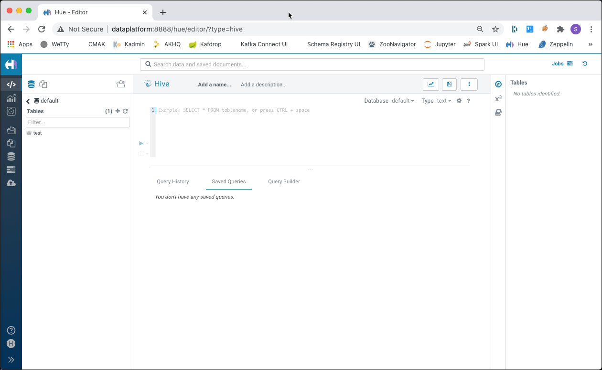
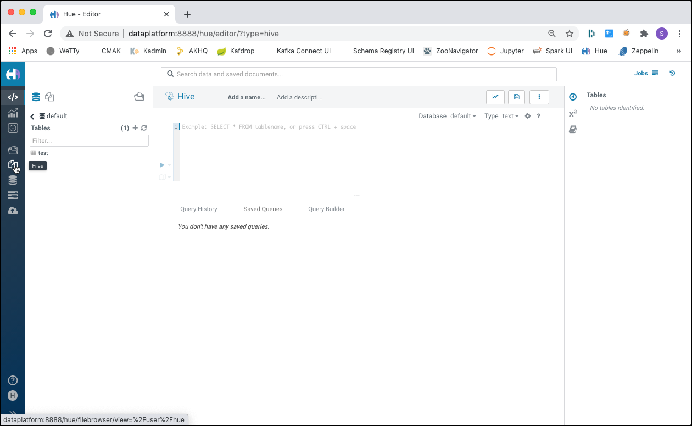
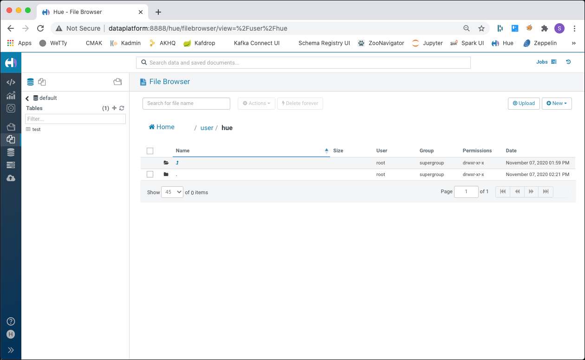
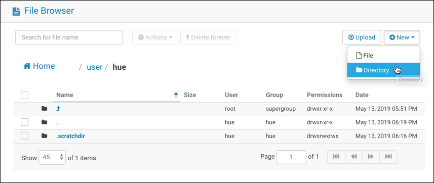
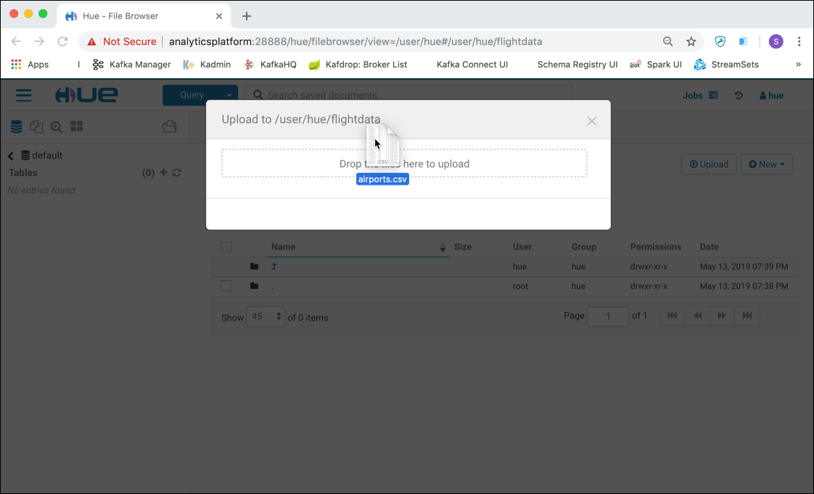
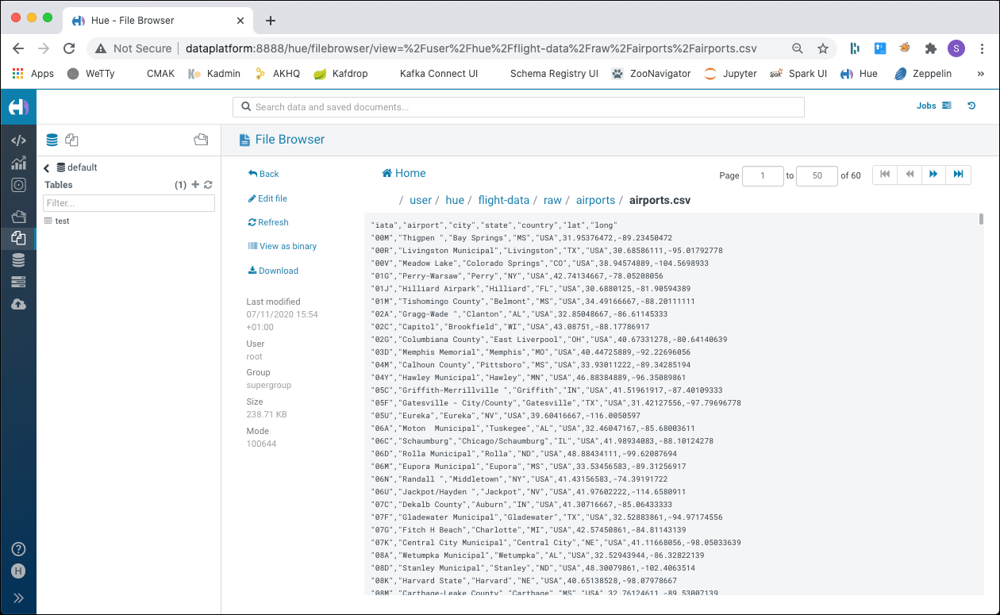
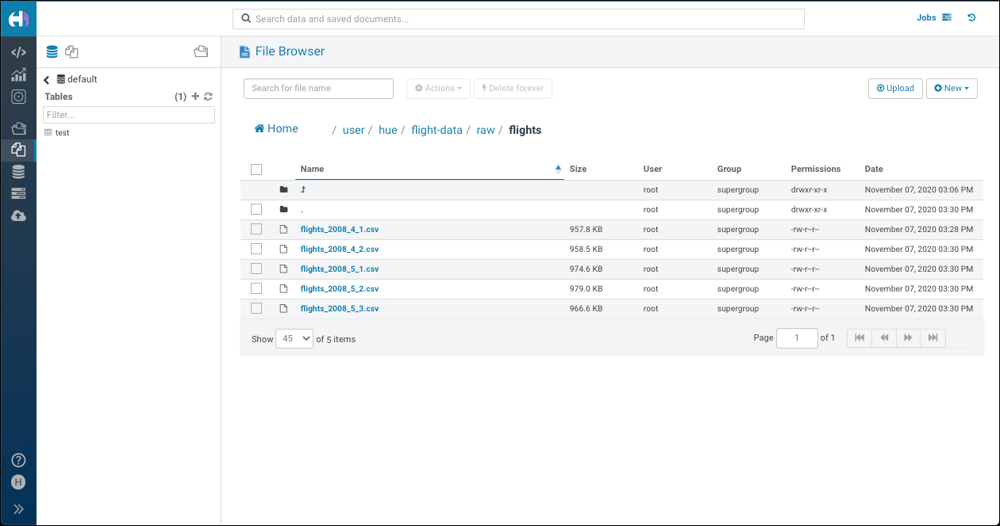

# Loading Data Into HDFS

For this workshop you have to start a platform using the `hdfs` flavour in the init script.

## Introduction

In this section, you will download the sensor data and load that into HDFS using the Hue File Browser. From there you can perform tasks like create directories, navigate file systems and upload files to HDFS. In addition, you’ll perform a few other file-related tasks as well.  

The Hadoop Distributed File System (HDFS) is a core component of Apache Hadoop and is designed to store large files with streaming data access patterns, running on clusters of commodity hardware. 

We assume that the **Analytics platform** described [here](../01-environment) is running and accessible. 

##	 Accessing HDFS

There various ways for accessing HDFS. In this workshop we will use the following

 * **Hadoop Command** - accessing HDFS from the command line
 * **Hue** - a browser based GUI for working with a Hadoop cluster
  
### Using the Hadoop Command with the File System Shell

The [Hadoop Command](https://hadoop.apache.org/docs/current/hadoop-project-dist/hadoop-common/CommandsManual.html) allows us to work with Hadoop and HDFS through the command line. 
In this workshop we are going to use the [File System Shell](https://hadoop.apache.org/docs/current/hadoop-project-dist/hadoop-common/FileSystemShell.html).  We can use it to create a directory, upload files, move files, delete files or folder and many more. You can access it using the `hadoop fs` command. 

In our environment, the Hadoop command is accessible inside the `namenode` container. To access the help for the `fs` command, enter

```bash
docker exec -ti namenode hadoop fs
```

and you should get the help page in return

```bash
bigdata@bigdata:~$ docker exec -ti namenode hadoop fs
Usage: hadoop fs [generic options]
	[-appendToFile <localsrc> ... <dst>]
	[-cat [-ignoreCrc] <src> ...]
	[-checksum <src> ...]
	[-chgrp [-R] GROUP PATH...]
	[-chmod [-R] <MODE[,MODE]... | OCTALMODE> PATH...]
	[-chown [-R] [OWNER][:[GROUP]] PATH...]
	[-copyFromLocal [-f] [-p] [-l] <localsrc> ... <dst>]
	[-copyToLocal [-p] [-ignoreCrc] [-crc] <src> ... <localdst>]
	[-count [-q] [-h] <path> ...]
	[-cp [-f] [-p | -p[topax]] <src> ... <dst>]
	[-createSnapshot <snapshotDir> [<snapshotName>]]
	[-deleteSnapshot <snapshotDir> <snapshotName>]
	[-df [-h] [<path> ...]]
	[-du [-s] [-h] <path> ...]
	[-expunge]
	[-find <path> ... <expression> ...]
	[-get [-p] [-ignoreCrc] [-crc] <src> ... <localdst>]
	[-getfacl [-R] <path>]
	[-getfattr [-R] {-n name | -d} [-e en] <path>]
	[-getmerge [-nl] <src> <localdst>]
	[-help [cmd ...]]
	[-ls [-d] [-h] [-R] [<path> ...]]
	[-mkdir [-p] <path> ...]
	[-moveFromLocal <localsrc> ... <dst>]
	[-moveToLocal <src> <localdst>]
	[-mv <src> ... <dst>]
	[-put [-f] [-p] [-l] <localsrc> ... <dst>]
	[-renameSnapshot <snapshotDir> <oldName> <newName>]
	[-rm [-f] [-r|-R] [-skipTrash] <src> ...]
	[-rmdir [--ignore-fail-on-non-empty] <dir> ...]
	[-setfacl [-R] [{-b|-k} {-m|-x <acl_spec>} <path>]|[--set <acl_spec> <path>]]
	[-setfattr {-n name [-v value] | -x name} <path>]
	[-setrep [-R] [-w] <rep> <path> ...]
	[-stat [format] <path> ...]
	[-tail [-f] <file>]
	[-test -[defsz] <path>]
	[-text [-ignoreCrc] <src> ...]
	[-touchz <path> ...]
	[-truncate [-w] <length> <path> ...]
	[-usage [cmd ...]]

Generic options supported are
-conf <configuration file>     specify an application configuration file
-D <property=value>            use value for given property
-fs <local|namenode:port>      specify a namenode
-jt <local|resourcemanager:port>    specify a ResourceManager
-files <comma separated list of files>    specify comma separated files to be copied to the map reduce cluster
-libjars <comma separated list of jars>    specify comma separated jar files to include in the classpath.
-archives <comma separated list of archives>    specify comma separated archives to be unarchived on the compute machines.

The general command line syntax is
bin/hadoop command [genericOptions] [commandOptions]
```

Find the documentation on the various options of the `hadoop fs` command here: <https://hadoop.apache.org/docs/stable/hadoop-project-dist/hadoop-common/FileSystemShell.html>

So to get a directory listing of the folder `user` in HDFS, you would use

```bash
docker exec -ti namenode hadoop fs -ls /user
```

to get back a result similar to this

```bash
bigdata@bigdata:~$ docker exec -ti namenode hadoop fs -ls /user
Found 3 items
drwxr-xr-x   - root supergroup          0 2019-05-13 15:59 /user/hive
```

### Using Hue

[Hue](http://gethue.com/) is a web-based interactive query editor in the Hadoop stack that lets you visualise and share data.

To use it, we first have to create the "home directory" in HDFS for the user `hue`. We can do that by using the `mkdir` option of the `hadoop fs` command.

```bash
docker exec -ti namenode hadoop fs -mkdir -p /user/hue
```

In a browser window navigate to <http://dataplatform:28888> and sign in with user `hue` and password `hue`. You should be forwarded to the **Hue** homepage. 

If asked for the tour through Hue, either follow it, or just close the window. You should end up on the Hue homepage.



To access the File Browser, navigate to the menu on the left and select the **Files** icon



The file browser will show up on the details pane to the right



The browser is positioned on the users home folder, which is `/user/hue` because we are logged-in as user `hue`.

## Working with HDFS 

We are going to upload some files using both the **Hadoop File Shell** as well as **Hue**. In practice you would choose the one fitting the use case best. 

We will be using data of airports and carriers, available here [/01-environment/docker/data-transfer/flightdata](../01-environment/docker/data-transfer/flightdata).

### Creating folders

To create a new folder in *Hue*, make sure that you are on the folder `/user/hue` and click on the **New** button in the File Browser to the right and select **Directory**.



Enter `fligh-tdata` into the **Directory Name** and click **Create**. We will use this folder for holding some files we upload later.

To create the folder with the **Hadoop File Command** instead of using **Hue**, use the `mkdir` command

```bash
docker exec -ti namenode hadoop fs -mkdir -p /user/hue/flight-data/raw/airports &&
  docker exec -ti namenode hadoop fs -mkdir -p /user/hue/flight-data/raw/plane-data &&
  docker exec -ti namenode hadoop fs -mkdir -p /user/hue/flight-data/raw/carriers && 
  docker exec -ti namenode hadoop fs -mkdir -p /user/hue/flight-data/raw/flights
```

### Uploading the Flight data files

Now with the directories in place, we can start uploading data. The files we upload here are rather small. They have been downloaded in the `data-transfer` folder when creating the dataplaform. 

Use the `ls` command on the docker host

```bash
ls -lsa $DATAPLATFORM_HOME/data-transfer/flight-data/
```

and you should see the following files

```bash
ubuntu@ip-172-26-6-34:~/hadoop-spark-workshop/01-environment/docker-hdfs$ ls -lsa $DATAPLATFORM_HOME/data-transfer/flight-data
total 2336
  4 drwxr-xr-x 4 root   root     4096 Nov  7 12:28 .
  4 drwxr-xr-x 3 ubuntu ubuntu   4096 Nov  7 12:17 ..
  4 -rw-r--r-- 1 root   root     1952 Nov  7 12:28 README.md
240 -rwxr-xr-x 1 root   root   244438 Nov  7 12:28 airports.csv
588 -rw-r--r-- 1 root   root   598901 Nov  7 12:28 airports.json
 44 -rwxr-xr-x 1 root   root    43758 Nov  7 12:28 carriers.csv
 76 -rw-r--r-- 1 root   root    76537 Nov  7 12:28 carriers.json
  4 drwxr-xr-x 2 root   root     4096 Nov  7 12:28 flights-medium
  4 drwxr-xr-x 2 root   root     4096 Nov  7 12:28 flights-small
420 -rwxr-xr-x 1 root   root   428558 Nov  7 12:28 plane-data.csv
948 -rw-r--r-- 1 root   root   968807 Nov  7 12:28 plane-data.json
```

We can use **Hue** to upload files, but only if they do not exceed 100 MB in size. And the files have to available on the machine where the web browser runs on. 

To upload a file, navigate to the directory where the file should be uploaded to and then click on **Upload**. Now you can either drag-and-drop the files to be uploaded or click on **Select files** to use the file browser to select the files to be uploaded.



Two of the files (`airports.csv` and `carriers.json`) to be uploaded are also checked into Github and are available here: <https://github.com/gschmutz/hadoop-spark-workshop/tree/master/02-hdfs/flightdata>. Download them to your local machine to be able to upload them using Hue. 

Alternatively use the **Hadoop File Command** to upload all the files.

```bash
docker exec -ti namenode hadoop fs -copyFromLocal /data-transfer/flight-data/airports.csv /user/hue/flight-data/raw/airports

docker exec -ti namenode hadoop fs -copyFromLocal /data-transfer/flight-data/carriers.json /user/hue/flight-data/raw/carriers

docker exec -ti namenode hadoop fs -copyFromLocal /data-transfer/flight-data/plane-data.csv /user/hue/flight-data/raw/plane-data
```

### Viewing directory content

To see a listing of files we have uploaded from the command line, just perform 

```bash
docker exec -ti namenode hadoop fs -lsr /user/hue/flight-data/
```

and you should see an output similar to the one below.

```bash
ubuntu@ip-172-26-6-34:~/hadoop-spark-workshop/01-environment/docker-hdfs$ docker exec -ti namenode hadoop fs -lsr /user/hue/flight-data/
lsr: DEPRECATED: Please use 'ls -R' instead.
drwxr-xr-x   - root supergroup          0 2020-11-07 15:06 /user/hue/flight-data/raw
drwxr-xr-x   - root supergroup          0 2020-11-07 14:54 /user/hue/flight-data/raw/airports
-rw-r--r--   3 root supergroup     244438 2020-11-07 14:54 /user/hue/flight-data/raw/airports/airports.csv
drwxr-xr-x   - root supergroup          0 2020-11-07 14:55 /user/hue/flight-data/raw/carriers
-rw-r--r--   3 root supergroup      76537 2020-11-07 14:55 /user/hue/flight-data/raw/carriers/carriers.json
drwxr-xr-x   - root supergroup          0 2020-11-07 14:54 /user/hue/flight-data/raw/flights
drwxr-xr-x   - hue  supergroup          0 2020-11-07 15:05 /user/hue/flight-data/raw/plane-data
-rw-r--r--   3 root supergroup     428558 2020-11-07 15:05 /user/hue/flight-data/raw/plane-data/plane-data.csv
```

Of course we can also use **Hue** to navigate to the folders and see that the files have been uploaded successfully. 

### Viewing content of a file

To view the content of a file in **Hue**, just click on the file in the **File Browser**


and you should see the contents of the file as well as its metadata in a new window



You can use the controls at the top to page through the content of the file. 

To show the content of the file from the **Hadoop File Command` you use the `cat` command. 

```bash
docker exec -ti namenode hadoop fs -cat /user/hue/flight-data/raw/plane-data/plane-data.csv | head
```

because we pipe the result of the `cat` command into head, we only see the first 10 rows

```bash
ubuntu@ip-172-26-6-34:~/hadoop-spark-workshop/01-environment/docker-hdfs$ docker exec -ti namenode hadoop fs -cat /user/hue/flight-data/raw/plane-data/plane-data.csv | head
2020-11-07 15:07:25,991 INFO sasl.SaslDataTransferClient: SASL encryption trust check: localHostTrusted = false, remoteHostTrusted = false
tailnum,type,manufacturer,issue_date,model,status,aircraft_type,engine_type,year
N10156,Corporation,EMBRAER,02/13/2004,EMB-145XR,Valid,Fixed Wing Multi-Engine,Turbo-Fan,2004
N102UW,Corporation,AIRBUS INDUSTRIE,05/26/1999,A320-214,Valid,Fixed Wing Multi-Engine,Turbo-Fan,1998
N10323,Corporation,BOEING,07/01/1997,737-3TO,Valid,Fixed Wing Multi-Engine,Turbo-Jet,1986
N103US,Corporation,AIRBUS INDUSTRIE,06/18/1999,A320-214,Valid,Fixed Wing Multi-Engine,Turbo-Fan,1999
N104UA,Corporation,BOEING,01/26/1998,747-422,Valid,Fixed Wing Multi-Engine,Turbo-Fan,1998
N104UW,Corporation,AIRBUS INDUSTRIE,07/02/1999,A320-214,Valid,Fixed Wing Multi-Engine,Turbo-Fan,1999
N10575,Corporation,EMBRAER,06/24/2003,EMB-145LR,Valid,Fixed Wing Multi-Engine,Turbo-Fan,2002
N105UA,Corporation,BOEING,10/15/2007,747-451,Valid,Fixed Wing Multi-Engine,Turbo-Jet,1994
```

### Copying files to HDFS

In **Hue** you can perform various operations on file and directory level. You can find these in the **Action** drop-down menu above the file browser. To make a copy of the `airports.csv` file, select the file and select **Action** and navigate to **Copy**


In the pop-up window enter the path of the new file into the edit field and click **Copy**


A copy of the file is made and put into the folder specified. 


To copy the `carriers.csv` file using the **Hadoop File Command**, perform the following command

```bash
docker exec -ti namenode hadoop fs -mkdir -p /user/hue/flight-data/backup

docker exec -ti namenode hadoop fs -cp /user/hue/flight-data/raw/airports/airports.csv /user/hue/flight-data/backup/airports.csv
```

### Download a file from HDFS to the local filesystem

To download a file in **Hue**, select the `airports.csv` file in the **File Browser** and click **Actions** and **Download**. 


The file will end up in the downloads folder of your browser.


To download the `airports.csv` file using the **Hadoop File Command**, perform the following command

```bash
docker exec -ti namenode hadoop fs -copyToLocal /user/hue/flight-data/raw/airports/airports.csv /data-transfer
```

and a file should be written to the `$DATAPLATFORM_HOME/data-transfer` folder on the docker machine. 

```bash
ls $DATAPLATFORM_HOME/data-transfer/
```

As we don't need it locally, let's remove it. 

```bash
sudo rm $DATAPLATFORM_HOME/data-transfer/airports.csv
```

### Removing files in HDFS

To remove a file in **Hue**, select the file and click **Delete Forever**. 


Confirm the delete by clicking on **Yes** and the file will be removed immediately. 


To delete the `airports.csv` file in the backup folder using the **Hadoop File Command**, perform the following command

```bash
docker exec -ti namenode hadoop fs -rm /user/hue/flight-data/backup/airports.csv
```

## Upload flights for later use

Next let's upload some flights data files, all documenting flights in April and May of 2008.

Let's use the same command as above to upload the first file using the ** Hadoop File Command**:

```bash
docker exec -ti namenode hadoop fs -copyFromLocal /data-transfer/flight-data/flights-small/flights_2008_4_1.csv /user/hue/flight-data/raw/flights
```

you can also specify multiple source file to be loaded into the destination in HDFS:

```bash
docker exec -ti namenode hadoop fs -copyFromLocal /data-transfer/flight-data/flights-small/flights_2008_4_2.csv /data-transfer/flight-data/flights-small/flights_2008_5_1.csv /data-transfer/flight-data/flights-small/flights_2008_5_2.csv /data-transfer/flight-data/flights-small/flights_2008_5_3.csv  /user/hue/flight-data/raw/flights
```

All these files are no available in the HDFS under the `/user/hue/flight-data/raw/flights` folder.




